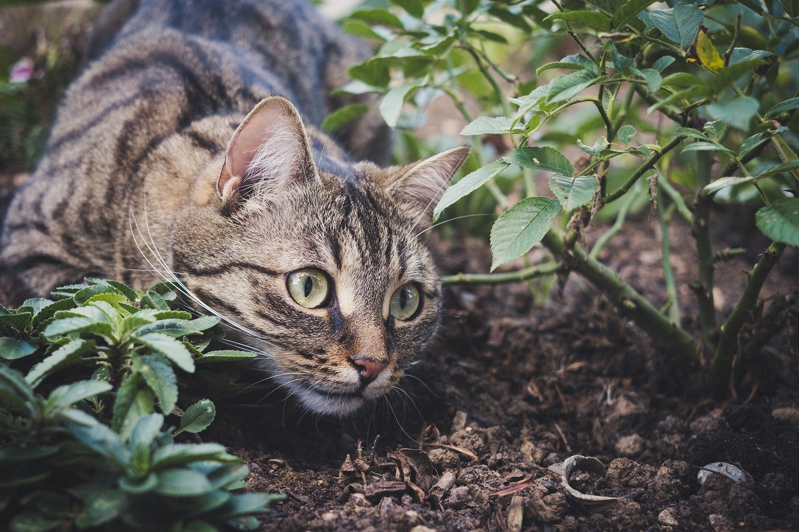

# NstPlaycloud
NstPlaycloud provides you a playground on your web browser, where you can try [Neural Style Transfer](https://www.tensorflow.org/tutorials/generative/style_transfer) with any images you like. NstPlaycloud can be deployed either as docker-compose stack(local dev environment), or as AWS CloudFormation stack(product environment).

## Examples
### Images
<table>
    <th>No.</th>    
    <th>Content</th>
    <th>Style</th>
    <th>Transfer</th>
    <tr>
        <td>1</td>
        <td></td>
        <td></td>
        <td></td>
    </tr>
    <tr>
        <td>2</td>
        <td></td>
        <td></td>
        <td></td>
    </tr>
    <tr>
        <td>3</td>
        <td></td>
        <td></td>
        <td></td>
    </tr>
</table>

### Images' Source Infomation
<table>
    <th>No.</th>    
    <th>Content</th>
    <th>Style</th>
    <tr>
        <td>1</td>
        <td>Image by <a href="https://pixabay.com/ja/users/miezekieze-607096/?utm_source=link-attribution&amp;utm_medium=referral&amp;utm_campaign=image&amp;utm_content=5618328">Sa Ka</a> from <a href="https://pixabay.com/ja/?utm_source=link-attribution&amp;utm_medium=referral&amp;utm_campaign=image&amp;utm_content=5618328">Pixabay</a></td>
        <td>Image by <a href="https://pixabay.com/ja/users/larisa-k-1107275/?utm_source=link-attribution&amp;utm_medium=referral&amp;utm_campaign=image&amp;utm_content=72939">Larisa Koshkina</a> from <a href="https://pixabay.com/ja/?utm_source=link-attribution&amp;utm_medium=referral&amp;utm_campaign=image&amp;utm_content=72939">Pixabay</a></td>
    </tr>
    <tr>
        <td>2</td>
        <td>By After <a href='https://en.wikipedia.org/wiki/en:Hokusai' class='extiw' title='w:en:Hokusai'>Katsushika Hokusai</a> - Restored version of <a href='//commons.wikimedia.org/wiki/File:Great_Wave_off_Kanagawa.jpg' title='File:Great Wave off Kanagawa.jpg'>File:Great Wave off Kanagawa.jpg</a> (rotated and cropped, dirt, stains, and smudges removed. Creases corrected. Histogram adjusted and color balanced.), Public Domain, <a href="https://commons.wikimedia.org/w/index.php?curid=5576388">Link</a></td>
        <td>By <a href='https://en.wikipedia.org/wiki/en:Vincent_van_Gogh' class='extiw' title='w:en:Vincent van Gogh'>Vincent van Gogh</a> - Transferred from the <a href='https://en.wikipedia.org/wiki/' class='extiw' title='w:'>English Wikipedia</a>, Public Domain, <a href="https://commons.wikimedia.org/w/index.php?curid=4603625">Link</a></td>
    </tr>
    <tr>
        <td>3</td>
        <td>Image by <a href="https://pixabay.com/ja/users/muratkalenderoglu-818685/?utm_source=link-attribution&amp;utm_medium=referral&amp;utm_campaign=image&amp;utm_content=657869">muratkalenderoglu</a> from <a href="https://pixabay.com/ja/?utm_source=link-attribution&amp;utm_medium=referral&amp;utm_campaign=image&amp;utm_content=657869">Pixabay</a></td>
        <td>Image by <a href="https://pixabay.com/ja/users/thedigitalartist-202249/?utm_source=link-attribution&amp;utm_medium=referral&amp;utm_campaign=image&amp;utm_content=2753428">Pete Linforth</a> from <a href="https://pixabay.com/ja/?utm_source=link-attribution&amp;utm_medium=referral&amp;utm_campaign=image&amp;utm_content=2753428">Pixabay</a></td>
    </tr>
</table>

## Prerequirement(AWS Resources)
- Route53 Domain
- Keypair for EC2 instances

## Prerequirement(Local Machine)
- Linux or Mac OS machine
- [AWS CLIv2](https://docs.aws.amazon.com/ja_jp/cli/latest/userguide/install-cliv2.html)
- [SAM CLI](https://docs.aws.amazon.com/ja_jp/serverless-application-model/latest/developerguide/serverless-sam-cli-install.html)
- [jq](https://stedolan.github.io/jq/download/)
- prepare the file : "secrets" for secret parameters by refering to "secrets.org"
- [nvidia-docker runtime](https://github.com/NVIDIA/nvidia-docker), if you deploy docker-compose stack on local environment.

## Deployment on Local(dev environment)
1. Clone this repository.
2. Up docker-compose stack. `docker-compose up -d`
3. Move to ./lambda directory. `cd ./lambda/`
4. Deploy AWS resources on Localstack. `./local_deploy.sh http://localhost:4566/`

## Deployment on AWS
1. Clone this repository
2. Run the deployment script : `./aws-deploy-stack.sh`
3. After Deployment has completed, you can access the web page : https://nstpc.YOUR_OWN_DOMAIN/

## Cleanup on AWS
1. Clone this repository
2. Run the cleanup script : `./aws-cleanup-stack.sh`
3. All images stored on s3 bucket are automatically downloaded on : `./backups/YYYYMMDD-hhmmss/original/`
4. Cleanup script waits until the stack deletion completes.
